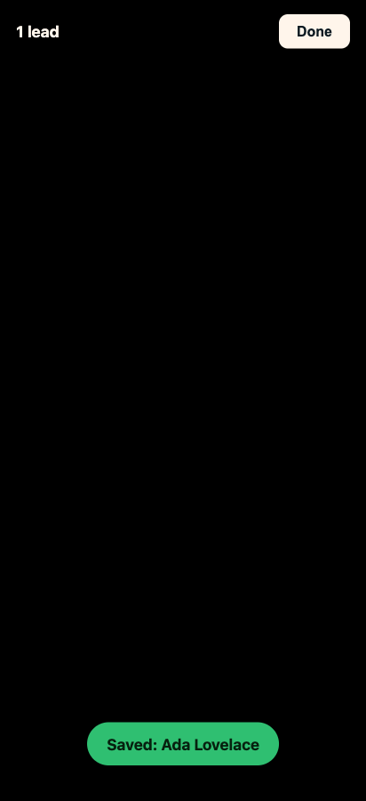
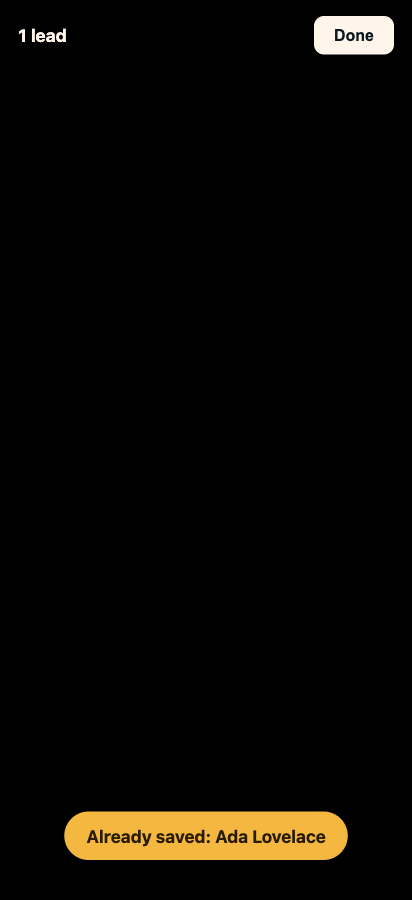
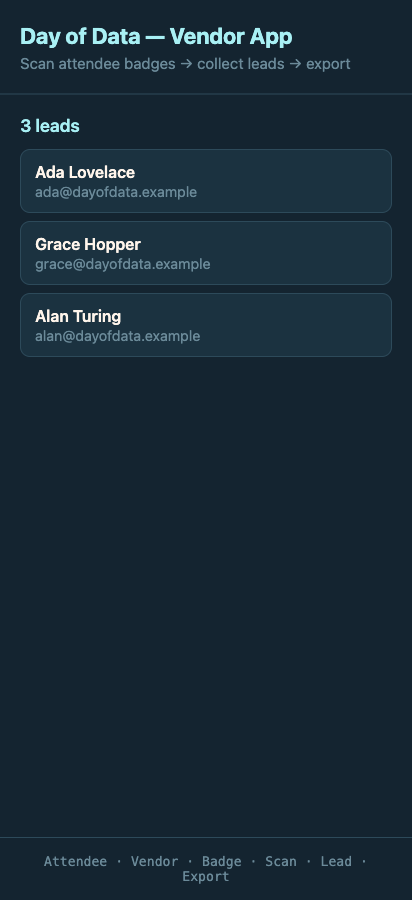

# 03 · Journey 1 — Scan & Collect Leads

← [The repeatable loop](02-the-repeatable-loop.md) · Next: [Journey 2 — Export →](04-feature-export.md)

**The feature:** a Vendor taps **Scan**, the camera opens, they point it at an Attendee's **Badge**, and a
**Lead** is saved with a confirmation — over and over, all day.

**Artifacts:** [grill](../qa-sessions/scan-feature-grilling.md) → [ADR-0001](../adr/0001-vcard-badge-payload.md)
+ [ADR-0002](../adr/0002-dedupe-leads-by-email.md) → [PRD](../prd/scan-and-collect-leads.md) → issues
[0001](../issues/0001-lead-collection-core.md)–[0004](../issues/0004-scanning-ergonomics-and-polish.md) →
hand-offs [slice-2](../handoffs/slice-2-camera.md)/[3](../handoffs/slice-3-graceful-failures.md)/[4](../handoffs/slice-4-ergonomics-polish.md).

---

## The grill: three decisions that mattered

Read the full transcript: **[scan-feature-grilling.md](../qa-sessions/scan-feature-grilling.md)**. The beats:

**Q1 — what's in the QR?** The spec left it open (plain text / vCard / JSON). The repo already de-facto used
vCard (the same `encodeVCard`/`parseVCard` module generates and reads Badges, so they can't drift). The
recommendation was to ratify **vCard 3.0 only, no fallback** — a tolerant fallback would only add untested
parsing paths for inputs that never occur. Answer: *"Yes I agree."* → **[ADR-0001](../adr/0001-vcard-badge-payload.md)**.

**Q3 — the moment the grill earned its keep.** A QR scanner decodes ~25 frames/second, so a Badge held in view
fires dozens of times. How do we avoid one Badge becoming 40 Leads? The recommendation was a "leaves-frame
gate." But the user changed direction entirely:

> *"We never want the same person twice, so if they have been scanned before we just ignore them."*

That's **full de-duplication** — and it **directly contradicts the written spec**, which lists de-dup under
*"Won't have (v1)"* ("if a vendor scans someone 3×, that's 3 rows — fine for now"). The grill **surfaced the
conflict out loud** instead of letting it drift:

> *Important conflict surfaced: this directly contradicts the written spec… Flagged as a deliberate reversal,
> not silent drift.*

This is the whole point of grilling. The follow-on (Q3b) pinned the *identity key* — **normalized email** —
and chose a **distinct "Already saved: Jane Doe"** confirmation over silent ignore (silence makes a Vendor think
the scanner is broken). Recorded as **[ADR-0002](../adr/0002-dedupe-leads-by-email.md)**; the
[`CONTEXT.md`](../../CONTEXT.md) Lead definition gained the uniqueness rule.

**Q4 onward — adopt the rest.** Full-screen camera overlay toggled by a `scanning` flag (no router — keeps it
URL-first); a **Done** button that releases the camera; a live "N leads" counter; non-blocking toasts. The user
fast-forwarded: *"move forward with all your recommendations on the rest of the questions."*

## The PRD & the slices

The grill became **[the PRD](../prd/scan-and-collect-leads.md)**, then four tracer-bullet slices:

| Slice | Issue | Tracer bullet |
|---|---|---|
| 1 | [Lead collection core](../issues/0001-lead-collection-core.md) | Pure `addLead` + localStorage + Home list — **no camera yet**, but a complete, demoable data spine |
| 2 | [Scan a Badge with the camera](../issues/0002-scan-a-badge-with-the-camera.md) | The camera overlay + decode → save |
| 3 | [Graceful failures](../issues/0003-graceful-failures.md) | Permission-denied / no-camera / not-a-badge |
| 4 | [Ergonomics & polish](../issues/0004-scanning-ergonomics-and-polish.md) | Live counter, toast timing, camera teardown |

Notice Slice 1 ships **before** the camera. That's a tracer bullet: the riskiest, most valuable logic (dedup +
persistence) gets built and tested first, end-to-end, with the UI it needs — not buried under camera plumbing.

## Hand-off → TDD

Slice 2's **[hand-off](../handoffs/slice-2-camera.md)** is a fresh-context brief: it states Slice 1 is done,
the exact seam to build, and the TDD cycle list. The real logic was built test-first as a **pure function**
([`src/lib/scan.ts`](../../src/lib/scan.ts) `handleScan`, over `addLead` in [`src/lib/leads.ts`](../../src/lib/leads.ts)) —
so dedup is proven without a camera — and the camera UI ([`src/ScanOverlay.tsx`](../../src/ScanOverlay.tsx)) is
thin glue on top, with an injectable scanner seam so tests drive decodes without real hardware.

## QA

Playwright drove the overlay live; the behaviors it confirmed — saved, already-saved, not-a-badge — became
durable component tests. The camera path itself was also scanned with a **real phone** over the tunnel, because
that's the one thing a headless browser can't prove.

## The transformation

Before this journey, the app was a static shell. After it, the core loop is alive: tap **Scan**, point at a
Badge, get a confirmation — saved, already-saved, or not-a-badge:

*Commit `b88f21b` (slices 2–4). The camera viewport is black here only because these were captured in a
headless browser — on a real phone it's the live camera feed; the HUD, counter, and toasts are the real UI.
And the leads land on Home:*

*Commit `a067d72` (slice 1) — the data spine, populated.*

---

Next: **[04 · Journey 2 — Export to CSV →](04-feature-export.md)** — and the bug that taught the best lesson in
the build.
