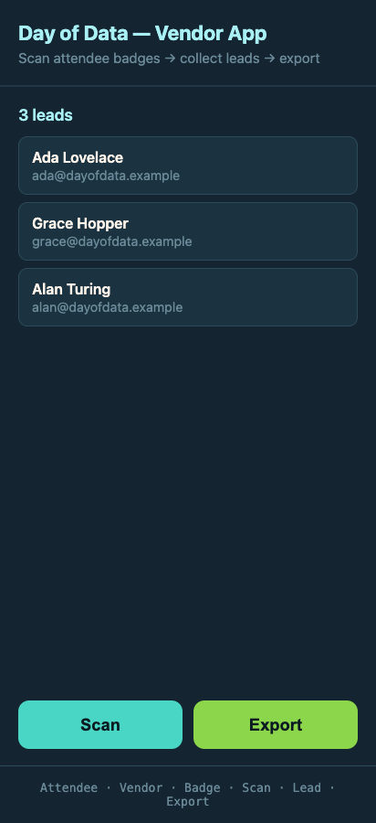

# 04 · Journey 2 — Export to CSV

← [Journey 1 — Scan](03-feature-scan.md) · Next: [Journey 3 — Badge Generator →](05-feature-badge-generator.md)

**The feature:** a Vendor with at least one Lead taps **Export** and gets a CSV of every Lead, ready to email
to their sales team.

**Artifacts:** [grill](../qa-sessions/export-feature-grilling.md) →
[ADR-0003](../adr/0003-export-csv-web-share.md) → [PRD](../prd/export-leads-to-csv.md) → issues
[0005](../issues/0005-export-leads-to-csv.md)/[0006](../issues/0006-web-share-handoff.md)/[0007](../issues/0007-export-desktop-download-fix.md) →
hand-offs [slice-5](../handoffs/slice-5-export-csv-download.md)/[6](../handoffs/slice-6-web-share-handoff.md)/[7](../handoffs/slice-7-export-desktop-download-fix.md).

---

## The grill: five clean decisions

Full transcript: **[export-feature-grilling.md](../qa-sessions/export-feature-grilling.md)**. This grill is a
good contrast to the Scan one — fewer surprises, more "name the right default and move":

- **Q1 — `mailto:` vs CSV.** A `mailto:` link *physically cannot attach a file* and its body is length-capped —
  useless past ~50 Leads. Answer: *"CSV download only."*
- **Q2 — columns.** *"Name, Email, Scanned At + header,"* ISO 8601 timestamp.
- **Q3 — the third spec ambiguity, resolved.** Should the export carry the Vendor's name/company? Answer:
  *"Anonymous — just the Leads."* The file is already identified by the inbox it's emailed from, and a Vendor
  identity would mean a whole accounts/settings concept v1 avoids. (That's the last of the spec's three open
  questions answered with a deliberate *"no."*)
- **Q4 — the hand-off.** *"Share sheet, fall back to download."* On a phone, the Web Share API opens the native
  share sheet with the CSV attached → tap Mail → done; on desktop it falls back to a file download. Recorded as
  **[ADR-0003](../adr/0003-export-csv-web-share.md)**. *(Hold that thought — this exact decision is where the
  bug hunt begins.)*
- **Q5 — encoding.** *"UTF-8 BOM + CRLF,"* so Excel opens accented names (José, Nguyễn) correctly instead of as
  mojibake.

## The slices

| Slice | Issue | Tracer bullet |
|---|---|---|
| 5 | [Export CSV (download)](../issues/0005-export-leads-to-csv.md) | The spine: pure `toCsv` (RFC-4180 + BOM + CRLF) + the Home Export button |
| 6 | [Web Share hand-off](../issues/0006-web-share-handoff.md) | Layer the mobile share sheet on top of the download |
| 7 | [Desktop download fix](../issues/0007-export-desktop-download-fix.md) | **A bug fix** — see below |

The heart of the feature is a **pure function**, [`toCsv`](../../src/lib/exportCsv.ts), built test-first: a
header row plus RFC-4180-quoted rows (a name with a comma stays in its field; quotes get doubled). The BOM, the
`File`, and the share-vs-download choice all sit at the I/O boundary *on top of* that pure core — the same shape
as the Scan feature, where pure logic sits under thin UI glue.

## The bug hunt (the short version)

Slices 5 and 6 shipped green. Then, testing the live app, **Export on a desktop handed back a file named like a
random UUID with no extension** — unopenable in Excel. The root cause and the (twice-surprising) investigation
are the centerpiece of the lessons chapter — **[read it in Chapter 06](06-lessons-and-bug-hunts.md#the-export-uuid-bug)** —
but the one-line version: the share-vs-download decision keyed on `navigator.canShare`, which is a *capability*,
not a *device* — and desktop browsers report it `true`. Slice 7 ([issue 0007](../issues/0007-export-desktop-download-fix.md),
[ADR-0003 Revision](../adr/0003-export-csv-web-share.md)) corrected the rule: **share only on a confirmed mobile
device; download on desktop and as the universal fallback.**

## QA

The download path's bytes were read back in Playwright (BOM present, comma-name quoted, accents intact); the
share path was driven with a stubbed `navigator.share`; and — the part that mattered most — the desktop fix was
proven on the *real* macOS browser where `canShare` is genuinely `true`, and the share path was confirmed on a
**real phone** over the tunnel.

## The transformation

The Export button joins Scan on Home — disabled at zero Leads, enabled (green) the moment there's one to send:

*Commit `c77ddaf` (slices 5–6), with the desktop behavior corrected in `2f87ae0` (slice 7). Tapping Export
downloads `day-of-data-leads-….csv` on desktop, or opens the share sheet → Mail on a phone.*

---

Next: **[05 · Journey 3 — Badge Generator →](05-feature-badge-generator.md)** — the stretch feature that closes
the loop.
