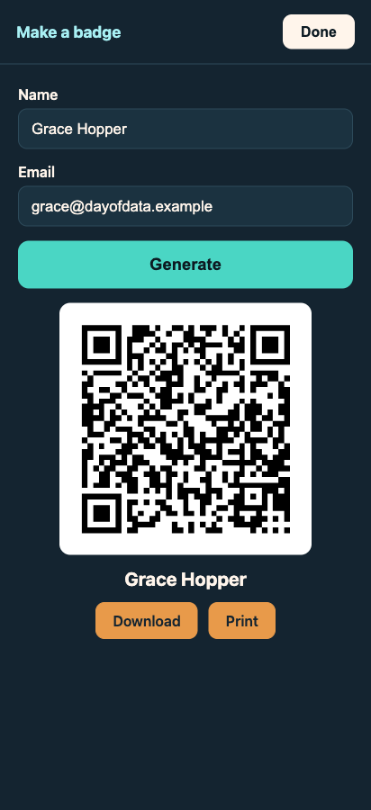

# 05 · Journey 3 — Badge Generator

← [Journey 2 — Export](04-feature-export.md) · Next: [Lessons & bug hunts →](06-lessons-and-bug-hunts.md)

**The feature:** a "Make a badge" view where you type an Attendee's name + email and get a QR **Badge** on
screen to display or print — so Attendees can self-serve, and the demo is self-contained (generate a Badge on
one phone, Scan it with another). This **closes the loop**: generate → Scan → Lead → Export.

**Artifacts:** [grill](../qa-sessions/badge-generator-grilling.md) → [PRD](../prd/badge-generator.md) → issues
[0008](../issues/0008-badge-generator-on-screen-qr.md)/[0009](../issues/0009-badge-generator-download-print.md) →
hand-offs [slice-8](../handoffs/slice-8-badge-generator-on-screen-qr.md)/[9](../handoffs/slice-9-badge-generator-download-print.md).

---

## The grill: scoping a stretch feature

Full transcript: **[badge-generator-grilling.md](../qa-sessions/badge-generator-grilling.md)**. The decisions:

- **Placement** — a quiet "Make a badge" link in the footer opening a full-screen view (the same toggle pattern
  as the Scan overlay, no router). It serves a *different actor* (an Attendee, or the demo), so it stays off the
  Vendor's core Scan/Export path.
- **Reuse, don't reinvent** — the Badge is built with the *same* tested
  [`encodeVCard`](../../src/lib/vcard.ts) the Scanner parses with, so a generated Badge is **guaranteed to scan
  back**. The generator and scanner can't drift because they share one module.
- **Explicit Generate, not live-as-you-type** — the user finishes typing, then taps Generate.
- **Minimal, forgiving validation** — name + email-ish; strip newlines (the vCard encoder doesn't escape them).
- **Two buttons** — Download (PNG) + Print, kept desktop-simple (a data-URL `<a download>`, no Web-Share
  machinery — deliberately *not* reusing ADR-0003's hand-off, because printing a badge is a desktop activity).

## Why this feature has *no* ADR

This is worth pausing on. An ADR is for decisions that are **hard to reverse, surprising, and a real
trade-off**. The Badge Generator's one hard-to-reverse decision — the **vCard payload** — was *already made*
back in [ADR-0001](../adr/0001-vcard-badge-payload.md), and this feature simply reuses it. Everything else
(button-vs-live, two-buttons, desktop-simple download) is a cheap, reversible UI call. So the grill recorded
those choices and **deliberately wrote no new ADR.** Knowing when *not* to create a record is as much the skill
as knowing when to.

## The slices

| Slice | Issue | Tracer bullet |
|---|---|---|
| 8 | [Form + Generate + on-screen QR](../issues/0008-badge-generator-on-screen-qr.md) | The tracer bullet: footer link → view → form → Generate → rendered QR |
| 9 | [Download + Print](../issues/0009-badge-generator-download-print.md) | Layer the two buttons on the generated Badge |

Pure logic first, as always: [`isValidBadgeInput`](../../src/lib/badge.ts) (test-first), then the view
([`src/BadgeGenerator.tsx`](../../src/BadgeGenerator.tsx)) with the QR generator injected as a seam
([`src/badgeQr.ts`](../../src/badgeQr.ts)) so it's testable without a real canvas — mirroring how Scan injects
its scanner and Export injects its hand-off.

## QA — the round-trip on real pixels

The most satisfying QA in the build: Playwright generated a Badge, then **decoded the rendered QR's actual
pixels** and confirmed they parsed back to the exact same vCard the app's own scanner reads. Generate → render
→ decode → same contact. The loop genuinely closes — proven, not asserted.

## The transformation

A "Make a badge" link now sits in the footer; it opens a full generator that renders a real, scannable Badge:

*Commit `4ce1e24` (slices 8–9). That QR is a real vCard — point the app's Scanner at it and it becomes a Lead.*

---

With this, the app has every v1 must-have **plus** the named stretch. Next: **[06 · Lessons & bug hunts →](06-lessons-and-bug-hunts.md)** —
the two debugging stories, told honestly.
