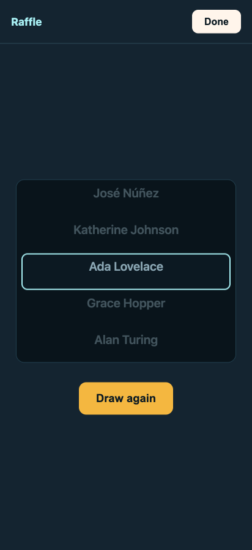
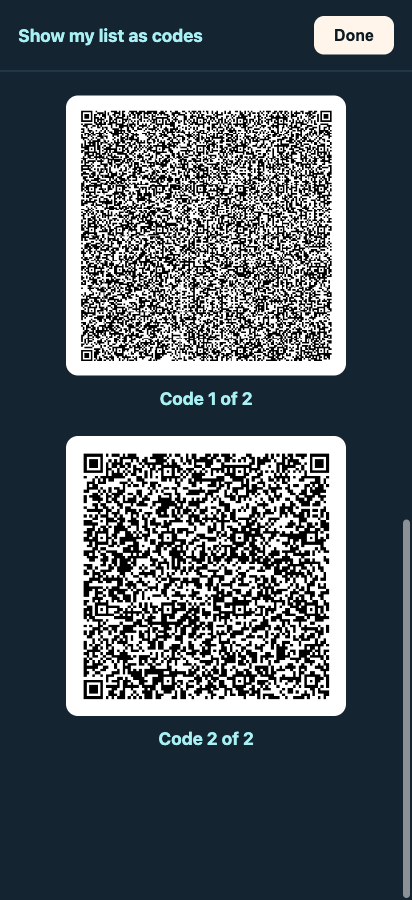

# 07 · Round two — when the client comes back

← [Lessons & bug hunts](06-lessons-and-bug-hunts.md) · [Back to the index](index.md)

---

The first six chapters are the *initial build*: a bare shell turned into a deployed app through one repeatable
loop. But a real app's story doesn't end at launch — and neither did this one. **This chapter is the loop
running a second time, on features the original brief never imagined**, because that's the part of "vibe coding"
people rarely show: what happens *after* you ship and a stakeholder actually uses the thing.

## The feedback that started it

We deployed the app to a real URL and showed it to the Day of Data organizers. One of them, Andy, used it for
real — scanned the sample badges, exported the CSV, even generated a badge in the app and scanned one made on a
*different* website to test the format. Then came the email every builder wants:

> *"I'm really impressed… I'm going to show this to everyone else, so they can be impressed too."*

…immediately followed by the email every builder *needs* — concrete, specific asks born from holding the
working product:

> *"The only other function that would be nice to have before the day would be a **raffle function**… randomly
> highlight a record… so that one person would be the winner of the raffle prize."*

…and a sharper observation about the booth reality (multiple staff, multiple phones, separate lists), with an
explicit "*please don't spend time on this*" caveat about a central database and its PII baggage.

This is product evolution in its most honest form. The appetite *sharpens* once the client can hold the real
thing — and the job is to fold that feedback back through the same disciplined loop, not to bolt it on ad hoc.

## Keeping the story honest: the spec grew, visibly

Someone following this walkthrough could be forgiven for asking *"where did these extra features come from?
They're not in the original brief."* Exactly right — so we **didn't pretend otherwise.** The original brief
([`spec_sheet.md`](../../spec_sheet.md) §1–§9) was left untouched as the historical artifact it is, and a new
**§10 "Round two"** was appended with its provenance recorded: who asked, why, and the open questions to grill.
Including the one we **declined on purpose** — a central database — with a standing answer for "why not just a
DB?" (§10.3): it would mean a server and the PII duty the whole local-first design exists to avoid.

## The grill, round two

Then the same first step as every feature: **[`/grill-with-docs`](../qa-sessions/raffle-and-merge-grilling.md)**
— one decision at a time, recommendation each. Two features came out sharp:

**Raffle.** A full-screen, *gamified* draw: a vertical reel of names that rolls, decelerates, and pops the
winner big, with a **Draw again** button. The decision that matters most is invisible on screen — the winner is
chosen *first* by a fair, uniform-random draw, and the animation is just choreography that lands on it (not
"wherever the wheel stops"). That keeps it provably fair *and* testable, because the random source is **injected
as a seam** — the very same pattern as the camera scanner, the exporter, and the QR generator before it. The
draw logic gets TDD'd; the *feel* of the reel gets a `/prototype`.

**Merge a teammate's list.** This is the answer to Andy's multi-phone observation — and a small case study in a
grill *not* taking the easy recommendation. The cheapest path was a file/AirDrop import (Export already builds
the shareable file). The user chose the richer one anyway: **chunked QR** — the sender shows a scrollable stack
of QR codes (the list split into small per-code chunks), the receiver scans them with a progress count, and the
app merges via the *existing* email dedup ([ADR-0002](../adr/0002-dedupe-leads-by-email.md)). It's deliberately
**peer-to-peer with no central store** — solving the multi-phone problem *without* the database Andy worried
about. That trade-off (and the honest note that we chose against the lower-effort file route) is recorded in
**[ADR-0004](../adr/0004-merge-lists-chunked-qr.md)**. The glossary ([`CONTEXT.md`](../../CONTEXT.md)) gained
**Raffle** and **Merge** the moment each was pinned.

## What shipped — the transformation

Both features went out as tracer-bullet slices (issues
[0010–0014](../issues/0010-raffle-draw-and-reveal.md)), each built by a fresh subagent from a focused hand-off
and then **independently and adversarially inspected** — which is where round two really earned the disciplines:

- The **Raffle** is a fair, uniform draw (`pickWinner` decides the winner *first*) wrapped in a gamified vertical
  name-reel — the feel tuned in a throwaway `/prototype`, the winner provably immune to the animation.

  

- **Merge** turns your list into a scrollable stack of QR codes a teammate scans to combine lists, peer-to-peer.

  

Two adversarial catches in this round are the lesson in miniature: a pure `reassembleChunks([])` that **crashed**
on empty input, and a receiver whose camera `start()` **floated its rejection** with no error UI — both surfaced
by re-reading and re-running the subagents' "green" work, both fixed test-first. And the live QA found that the
grill's "~20–25 Leads per QR" was **too dense to scan** (1,881 bytes); measuring it (then refusing to trust a
flaky headless proxy) drove the codes down to ~9/chunk at a larger render — to be confirmed on real phones.

## A feature the *build* surfaced — consolidation (round 2.5)

The best evidence that the loop is alive: **building** the basic Merge surfaced the *next* feature. Once Leads
could hop phone-to-phone in small QR codes, the Vendor realized they'd consolidate *throughout the day*, not in
one end-of-day dump — which raised a sharp question: *if I hand a batch off and it leaves my list, how do I still
never re-scan those people?*

So we grilled it (the [consolidation session](../qa-sessions/consolidation-grilling.md)). The crux: today the
active Leads list *is* the dedup index — so we **split it in two**: **active** Leads (what Home, Export, Raffle,
and a handoff act on) and **archived** Leads (handed off, hidden, but retained), with **dedup spanning the union**
so an archived Attendee can never be re-captured. Archiving is deliberate and reversible (chunked QR has no
delivery confirmation, so auto-archiving could silently lose Leads); **Restore** brings a batch back. It's a
genuine data-model change — recorded as **[ADR-0005](../adr/0005-active-archived-lead-lifecycle.md)**, which
**revises [ADR-0002](../adr/0002-dedupe-leads-by-email.md)** (the dedup scope) and lands in **`spec_sheet.md`
§10.4**. It's designed and queued to build next, through the same loop.

## What this chapter teaches

- **The loop is for maintenance, not just launch.** Grill → record → PRD → slice → TDD → QA works the same on a
  feature requested in an email six months later as on day one.
- **Let the spec grow in the open.** Append, attribute, and keep the original brief intact — the evolution *is*
  the story, and hiding it would only confuse the next reader.
- **A grill can talk you *out* of the easy path on purpose** — and the job is then to record *why*, so "why the
  hard way?" never becomes a mystery.

---

*Round two shipped through the same loop that wrote this chapter — Raffle, the basic Merge, and the
consolidation lifecycle the build itself sparked (active/archived Leads, ADR-0005, slices 0015–0017) are all
built, tested, and inspected. The method is the constant; the features just keep coming.* Start over from
**[the index](index.md)**, or open [`slides/index.html`](../../slides/index.html) and give the talk.
