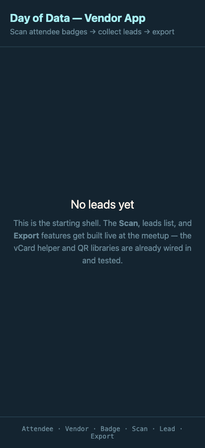

# Build Walkthrough — from idea to a shipped app, the AI-assisted way

> 👋 **New to vibe coding? You're in the right place — this is the start.** Read top to bottom and you'll see
> exactly how a one-line idea became a deployed app with AI doing the typing and a human staying the architect.
> No prior experience assumed; each step links to the real thing it produced.

This is the written companion to the *"Vibe Coding, the Pro Way"* talk (the deck lives in
[`slides/index.html`](../../slides/index.html)). The talk shows the *method*; this walkthrough shows the
**actual artifacts** the method produced — the real grills, decisions, plans, slices, hand-offs, code, and the
app changing screen by screen — so you can follow the exact same flow and come out with a great application of
your own.

Everything here is real. Every quote is pulled from the recorded grilling sessions. Every screenshot is the app
as it actually looked at that commit. Every link points at the artifact that drove the next step. Nothing is
reconstructed for the slides.

> **How to read it:** Start here, read [the repeatable loop](02-the-repeatable-loop.md) once, then walk the
> three feature journeys in order. Each journey has the same shape, so by the third one the rhythm is yours.

---

## The product in one line

A **Vendor** at a conference scans an **Attendee's** QR **Badge**, which saves a **Lead** (name + email +
time), and at the end exports all Leads as a **CSV** to email to their team. A small mobile web app — opened
at a URL, no install, everything stored locally on the phone.

Those bolded words are the **glossary** ([`CONTEXT.md`](../../CONTEXT.md)) — the shared language that appears
*verbatim* in the code, the tests, and the UI. Keeping the words consistent is what keeps a fast, forgetful AI
on the rails across dozens of sessions.

| Word | Meaning |
|---|---|
| **Attendee** | A conference-goer who wears a Badge. Scanned; doesn't use the app. |
| **Vendor** | The booth operator — the app's user. Scans all day, exports at the end. |
| **Badge** | A QR code encoding an Attendee's name + email (a vCard). |
| **Scan** | A Vendor capturing a Badge with the phone camera → yields a Lead. |
| **Lead** | A captured Attendee record (name, email, scan time). One per Attendee. |
| **Export** | A Vendor-triggered CSV of all Leads, handed off to email. |
| **Badge Generator** | A view that mints a Badge from a typed name + email (the stretch feature). |

The starting point was a bare shell — the topbar, "No leads yet," and the glossary — with the real features
built live:



---

## The repeatable loop

Every feature went through the **same loop**. It's the whole method, and it's worth internalizing once →
**[Chapter 02: The repeatable loop](02-the-repeatable-loop.md)**.

```
spec → /grill-with-docs → ADRs + glossary → /to-prd → /to-issues (slices)
     → /handoff → /tdd (red→green→refactor) → Playwright QA + real device → commit → deploy
```

Underneath it run a few non-negotiable disciplines ([`working-agreements.md`](../working-agreements.md)):
**never assume — chase every bug to its root cause**, **durable tests plus live QA**, and **dispatch each
slice to a fresh subagent, then independently inspect its work** (never trust the report alone).

---

## The three journeys

Each feature is one chapter, same skeleton: the grill decisions that mattered → what got recorded → the PRD →
the slices → the hand-off and TDD → the QA → the transformation screenshot.

1. **[Scan & Collect Leads](03-feature-scan.md)** — the camera spine. Where the grill *surfaced a conflict
   with the written spec* and we reversed it on purpose (full de-duplication).
2. **[Export to CSV](04-feature-export.md)** — getting the Leads off the phone. Carries the **desktop "UUID
   file" bug hunt** — the single best lesson in the whole build.
3. **[Badge Generator](05-feature-badge-generator.md)** — the stretch feature that closes the loop (generate a
   Badge → Scan it → Lead → Export). The grill that decided **no new ADR was needed**, and why.

Then: **[Lessons & bug hunts](06-lessons-and-bug-hunts.md)** — the two debugging stories told honestly,
including the one where the "bug" turned out to be the *test harness itself*.

And the story keeps going: **[Round two — when the client comes back](07-round-two-evolving-the-app.md)** — the
same loop running *again* on features the original brief never imagined (a gamified **Raffle**; a peer-to-peer
**Merge** of teammates' lists), driven by real stakeholder feedback after launch. Proof the method is for the
whole life of an app, not just day one.

---

## Reproduce this flow yourself

The loop, as a checklist you can run on your own idea:

1. Write a one-page **spec** with the ambiguities left *open* (don't pre-answer them).
2. Run **`/grill-with-docs`** — let the AI interview you one question at a time; it recommends, you steer.
   Capture the glossary and surface conflicts out loud.
3. Record the *hard-to-reverse, surprising* decisions as **ADRs**; keep the glossary in `CONTEXT.md`.
4. **`/to-prd`** — turn the alignment into a one-page plan.
5. **`/to-issues`** — slice the plan into **tracer bullets** (thin vertical threads, each demoable).
6. For each slice: **`/handoff`** (a fresh-context brief) → **`/tdd`** (one failing test at a time) →
   **Playwright** live QA → **commit**. Dispatch slices to subagents and inspect what comes back.
7. **Deploy** to a real URL.

That's it. The rest of this walkthrough is what it looked like when we actually did it.

---

## About this build

This app — and the walkthrough you just read — was built live for the **Day of Data** community (formerly
**SQL Saturday**) as a free, hands-on lesson for the community: not a throwaway demo, but a real app shipped
through a disciplined loop you can repeat on your own work. The point isn't this app — it's the *method*, and
what you walk away able to build yourself.

The session was coached by **[Obney.ai](https://obney.ai)** — led by **Daryl Roberts**, Head of AI at Obney —
the human staying the architect while the AI did the typing. A small thank-you to the Day of Data team and
everyone who showed up to build.
